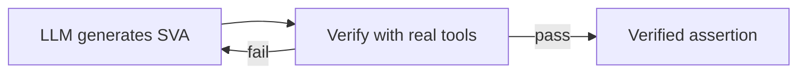

# chip_verification_learning

**The end goal:** an LLM that writes a hardware assertion, *runs it against real
verification tools*, reads its own failures, and rewrites until the property is proven —
a closed correctness loop with no human in it.



A learning-first project building toward a closed-loop, agentic system that uses an
LLM to **generate SystemVerilog Assertions (SVAs)** and then **verifies them with real
open-source EDA tools**, benchmarked in the spirit of NVIDIA's
[FVEval](https://github.com/NVlabs/FVEval).

Two equally-weighted goals: ship a clean, reproducible repo, **and** learn dynamic +
formal hardware verification from first principles. The full project charter, teaching
contract, and roadmap live in [`CLAUDE.md`](CLAUDE.md). The running study log — every
concept, in order, with takeaways — lives in [`LEARNING.md`](LEARNING.md).

> **Status: work in progress.** This README is a *progress tracker*, not the final
> polished writeup. The metrics-and-results README comes at M5.

## Where I am right now

**M1 complete** (last updated 2026-06-16).

| Milestone | Status | What it covers |
|---|---|---|
| **M0** — Foundations & toolchain | done | RTL basics, simulation vs formal, first proven SVA, counterexample (DUT: `mux2`) |
| **M1** — Hand-written assertions on a stateful DUT | done | clocked logic & reset, `assert`/`assume`/`cover`, safety vs liveness, BMC depth, counterexample + cover witness, **vacuity** (DUT: `fifo_ctrl`) |
| **M2** — The LLM generation loop | next | generate SVAs from spec/RTL → check syntax → simulate/prove → feed failures back |
| **M3** — Benchmark vs FVEval NL2SVA | planned | valid % / pass % / injected-bug-catch % vs a one-shot baseline |
| **M4** — Differentiation | planned | MCP tool server; generator/critic/oracle multi-agent; optional security properties |
| **M5** — GitHub polish | planned | final README with metrics + honest limitations |

**To resume from here:** start M2. The M1 formal flow (`fifo_ctrl`) is the working
*oracle* the generation loop will call. See the "Next" note at the bottom of
[`LEARNING.md`](LEARNING.md).

## Repo layout

```txt
rtl/      DUTs            — inverter.v, mux2.v, fifo_ctrl.v
sva/      assertions      — (empty for now; M1 properties live in formal/)
formal/   SymbiYosys      — *_formal.sv wrappers + .sby scripts
sim/      testbenches     — mux2_tb.v
agent/    LLM loop        — (M2)
evals/    eval harness    — (M3)
```

## Setup (one-time)

The EDA toolchain is Linux-first; this repo lives on Windows and runs the tools via
**WSL2 + Ubuntu** with the [OSS CAD Suite](https://github.com/YosysHQ/oss-cad-suite-build)
(bundles Yosys, SymbiYosys/`sby`, Verilator, Icarus, SMT solvers). Verified versions:
Yosys 0.66, sby 0.66, Verilator 5.049, Icarus 14.0. Full setup notes are in
[`LEARNING.md`](LEARNING.md) (M0).

## Reproduce the current results

From the Windows host (PowerShell), or natively from a Linux shell with the OSS CAD
Suite on `PATH`:

```powershell
# M0 — prove the combinational mux2 contract
wsl -e bash -lc "cd /mnt/c/Users/paffo/Documents/Projects/chip_verification_learning/formal && sby -f mux2.sby"

# M1 — FIFO controller: safety proof + reachability cover (two tasks)
wsl -e bash -lc "cd /mnt/c/Users/paffo/Documents/Projects/chip_verification_learning/formal && sby -f fifo_ctrl.sby"
```

Expected for `fifo_ctrl.sby`: task `bmc` → `DONE (PASS)` (safety holds), task `cover`
→ `DONE (PASS)` with `full` reached around step 6 (the FIFO can genuinely fill).

## Honest limitations (so far)

- **Open tools cover a *subset* of SVA.** Yosys's open front-end accepts only
  *immediate* assertions in procedural blocks — not full concurrent SVA
  (`assert property (@...)`, `|->`, `$past`). Temporal properties are built by hand
  with explicit history flops. Full SVA needs a commercial front-end (Verific →
  JasperGold / VC Formal). FVEval's full scoring flow likewise assumes a commercial
  formal backend; we replicate its *spirit* on open tools, not industrial sign-off.
- **BMC is bounded.** A clean `mode bmc` proves "no violation within `depth` cycles,"
  not for all time. Unbounded proof (`mode prove` / k-induction) is not yet wired up.
- **Liveness is not proven.** M1 properties are all *safety*. Liveness ("a pending
  read is eventually served") is named as a gap, not faked — open-tool liveness is thin.
